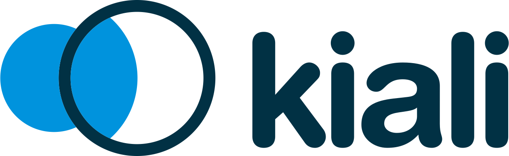

---

<h1 align="center">Hi 👋, I'm Steven (Yarzar Sein Win)</h1>
<h4 align="center">🚀 Principal Engineer | Kubernetes | Cloud-Native | DevOps | DevSecOps | GitOps | SRE</h4>

  
  
  

---

### 🌟 About Me  
- 🔭 Currently working as **Principal Engineer @ SSMC**  
- 🌱 Learning **Advanced Cloud-Native Security & DevSecOps**  
- 👯 Looking to collaborate on **Kubernetes, GitOps & Cloud-Native Projects**  
- 🤝 Open to discussions on **Gen-3 CI/CD (CI with DevSecOps & CD with GitOps), Cloud-Native & Site Reliability Engineering (SRE)**  
- 👨‍💻 Portfolio: [stevenseinwin.com](https://stevenseinwin.com)  
- 💬 Ask me about:  
  - Kubernetes & Container Orchestration  
  - Gen-3 CI/CD (CI with DevSecOps & CD with GitOps)  
  - Infrastructure as Code (Terraform, Ansible, Helm)  
  - Cloud Platforms (AWS | Azure)  
  - SRE Best Practices (Monitoring, Reliability & Incident Management)  
  - Observability (Prometheus, Grafana, ELK, Jaeger, APM)  
  - DevSecOps & Cloud Security  
  - Scalability & High Availability Architectures  
- 📫 Reach me at: **yarzarseinwin@gmail.com & stevenseinwin@gmail.com**  

---

#### 🤝 Connect With Me

---

<h1 align="center">⚒️ Tech Stack & Tools</h1>

  
  
  
  
  
  
  
  
  
  
  
  
  
  
  
  
  
  
  
  
  
  
  
  
  
  
  
  
  
  
  
  
  
  
  
  
  
  
  
  
  
  
  
  
  
  
  
  
  
  
  
  
  
  
  

## ⚙️ DevOps Stack  

**🛠 DevOps Build & Artifact Stack:**  
JUnit, xUnit, Maven, MSBuild, Gradle, Nexus, JFrog Artifactory, Docker Build, AWS ECR, Harbor  

**🔐 DevSecOps Stack:**  
Trivy, SonarQube, Snyk, OWASP ZAP, OpenPubkey  

**🔄 Continuous Integration Stack:**  
Jenkins, GitLab, GitLab CI/CD, GitHub, GitHub Actions  

**🚀 Continuous Deployment Stack:**  
ArgoCD, Argo Rollouts  

**🧪 Continuous Testing Stack:**  
Selenium, Locust, JMeter  

**📊 Continuous Monitoring (Observability):**  
Datadog, OpenTelemetry, Prometheus, Grafana, ELK / Elastic Observability, Jaeger, Kiali  

**📜 Infrastructure as Code Stack:**  
Terraform, Ansible  

---

## 🏗️ Infra Stack  
**☸️ Kubernetes Stack**  
Kubernetes, Docker, Rancher Manager, RKE2, Helm, Kustomize, Istio, Envoy, Calico, Cilium, Hubble UI, eBPF, Vault, Consul  

**☁️ Cloud Stack**  
AWS, Azure  

**🐧 OS Stack**  
Linux, Red Hat, Ubuntu, CentOS, Windows  

**🌍 Networking Stack**  
Cisco, Aruba, Cisco ACI, DNA Center, Wireless Controller  

**🔐 Network Security Stack**  
Palo Alto, FortiGate, Cisco FirePower, Cisco ISE, Aruba ClearPass, Bluecoat Proxy, Cisco Email Security (ESA), Tipping Point, Invisiron  

**🛡️ SOC Center Stack**  
Tenable, IBM QRadar, Splunk, Incident Response  

---

## 💻 Programming Stack  

**📝 Language Stack**  
Python, Java  

**🗄️ Database Stack**  
PostgreSQL, MySQL  

**🌐 API Gateway Stack**  
Spring Cloud, Ocelot, Postman  

**📋 Project Management Stack**  
ServiceNow, Jira  

---

### 📊 GitHub Analytics

  
  

---

### 🚀 Featured Projects  
- 🔹 [Cloud-Native CI/CD with GitOps](#) — Automating CI/CD with ArgoCD & Tekton  
- 🔹 [Kubernetes Observability Stack](#) — Prometheus, Grafana, Loki & Jaeger integration  
- 🔹 [Terraform AWS Infrastructure](#) — Scalable multi-region AWS infrastructure with IaC  

---

### ⚡ Fun Fact  
*"DevOps isn’t just about tools — it’s about culture, automation, and delivering value at scale."*  

  

---

  
  

---

### 🎓 Certifications
- 🏅 AWS Certified Solutions Architect  
- 🏅 Certified Kubernetes Administrator (CKA)  
- 🏅 Terraform Associate  

---

### 📝 Latest Blog Posts
<!-- BLOG-POST-LIST:START -->
- [Kubernetes GitOps with ArgoCD](#)
- [Terraform Best Practices for Multi-Cloud](#)
- [Observability with Prometheus + Grafana](#)
<!-- BLOG-POST-LIST:END -->

---

> whoami
👨‍💻 Steven (Yarzar Sein Win) | Principal DevOps Engineer  

> skills --list
🛠️ Kubernetes | CI/CD | Terraform | GitOps | Cloud-Native | DevSecOps | SRE | Observability  

> contact --email
📧 yarzarseinwin@gmail.com  

---

### 🏆 Key Achievements
- 🚀 Built **Enterprise-Scale Kubernetes CI/CD (GitOps + DevSecOps)** at SSMC  
- ☁️ Designed **Multi-Cloud Infrastructure with Terraform** (AWS + GCP)  
- 🔐 Led adoption of **Cloud-Native Security Practices** company-wide  
- 📈 Improved deployment velocity by **300%** with modern pipelines  

---

> 🧠 *"Automating today, scaling tomorrow — DevOps is not a role, it’s a culture."*

---

### 📝 Latest Posts
<!-- BLOG-POST-LIST:START -->
- [Kubernetes GitOps with ArgoCD](#)
- [Multi-Cloud with Terraform](#)
- [SRE Best Practices in Real-World Systems](#)
<!-- BLOG-POST-LIST:END -->

---

  <!-- DevOps & CI/CD -->
  
  
  
  
  
  
  
  <!-- Build & Artifact -->
  
  
  
  
  
  
  
  
  
  

  <!-- DevSecOps -->
  
  
  
  
  

  <!-- Testing -->
  
  
  

  <!-- Monitoring / Observability -->
  
  
  
  
  
  
  

  <!-- Kubernetes / Cloud -->
  
  
  
  
  
  
  
  
  
  
  
  
  
  

  <!-- OS -->
  
  
  
  
  

  <!-- Programming & Database -->
  
  
  
  

  <!-- API & Project Management -->
  
  
  
  
  

---

